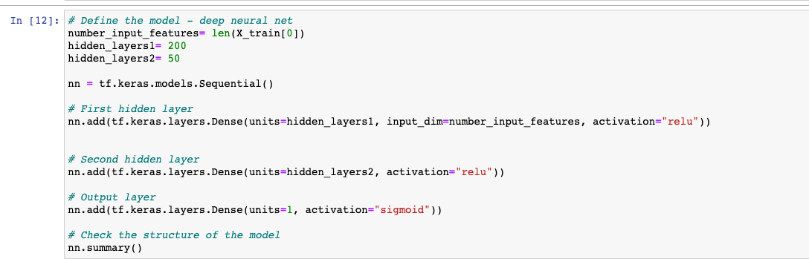
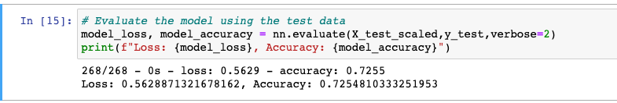
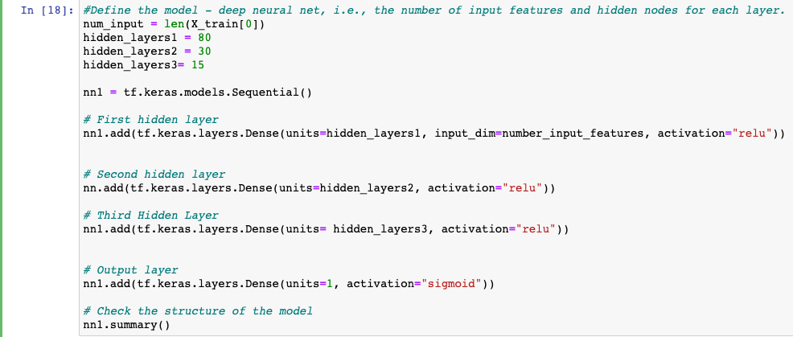
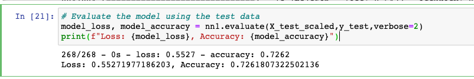
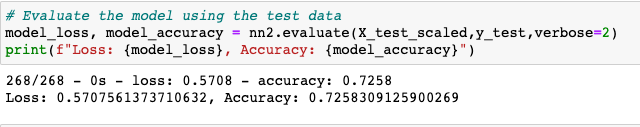

# Deep Learning Homework: Charity Funding Predictor

## Overview of my analysis

The non-profit foundation Alphabet Soup wants to create an algorithm to predict whether or not applicants for funding will be successful. Using Machine learning and Neural networks for this project. I have used features in the dataset to create a binary classifer that will help to predict whether applicants will be successful if funded by Alphabet Soup. For the analysis we had data containing 34,000 organizations that have received funding from Alphabet Soup. Below are overview steps taken for this project.

* Preprocessing the data for the neural network
* Compile, Train and Evaluate the model
* Optimize the model

## Results

### Data Processing
 - Variable that was considered as the target for my model: IS_SUCCESSFUL Column.
 - Variable that was considered to be the features for the model: Every Column except for IS_SUCCESSFUL which is our target and the ones we will drop
 - Variable that were neither targets or features for the dataset: Columns that I dropeed are EIN, NAME because they have no values or impact on our outcome. 

### Compiling, Training, and Evaluating the Model
 - Used 2 Hidden Layers
 - Applied 200 neurons (Layer1), 50 neurons (Layer2)
 - Used "relu" activation function for the first and second hidden layers and "sigmoid" activition funciton for the output layer.

   

Was the model able to achieve the target model performance?

 - The model was not able to reach the target 75%. The accuracy for my model was 72%.
 
 
 
Below are the next two attempts taken to increase the model performance.
### Attempt2 
 - Used 3 Hidden Layers
 - Applied 80 neurons (Layer1), 80 nuerons (Layer2)
 - Used  Used "relu" activation function for the first and second hidden layers and "sigmoid" activition funciton for the output layer.
 
  

Was the model able to achieve the target model performance?

 - The model was not able to reach the target 75%. The accuracy for my model on second attempt was 72%.

  
 
### Attempt3
 - Changed the activation function of output layer from "sigmoid" to "tanh". The accuracy of the model remain same to 72%

   

   

# Summary

After applying optimization and multiple attempts the model accuracy score remained 72%. The score is very close to the requirement score of 75%. I believe if we had more detail data between all applications we can create a better model. 

